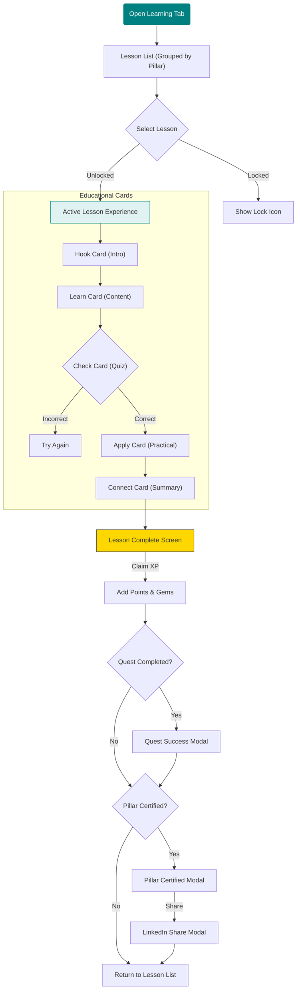
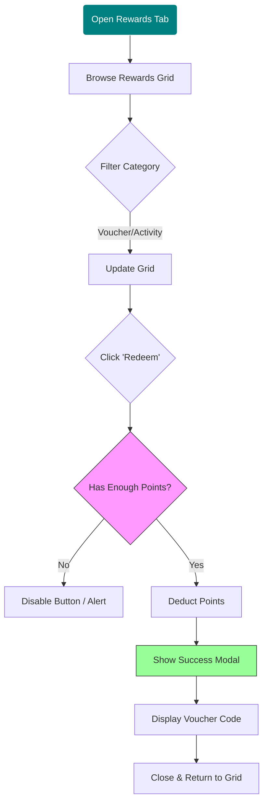
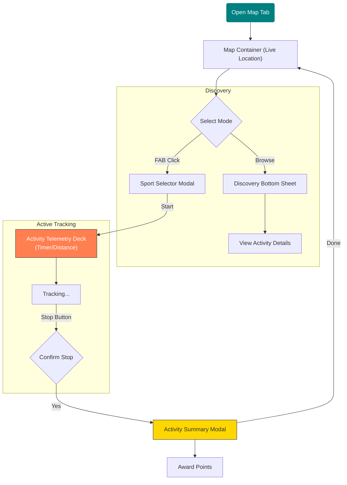

# Feature User Flow Diagrams

This document visualizes the detailed user flows for the core engagement features of ENHGAGE: **Learning**, **Rewards**, and **Map Activity**.

## 1. Learning Flow (The Education Loop)
This flow details how a user selects a lesson, progresses through cards, and earns certification.

## 2. Rewards Flow (The Redemption Loop)
This flow shows how users browse, filter, and redeem their hard-earned points.

## 3. Map & Activity Flow (The Physical Loop)
This flow covers the exploration mode and tracking physical activities.

