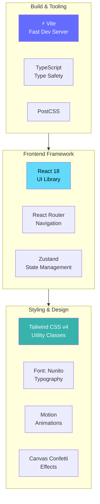
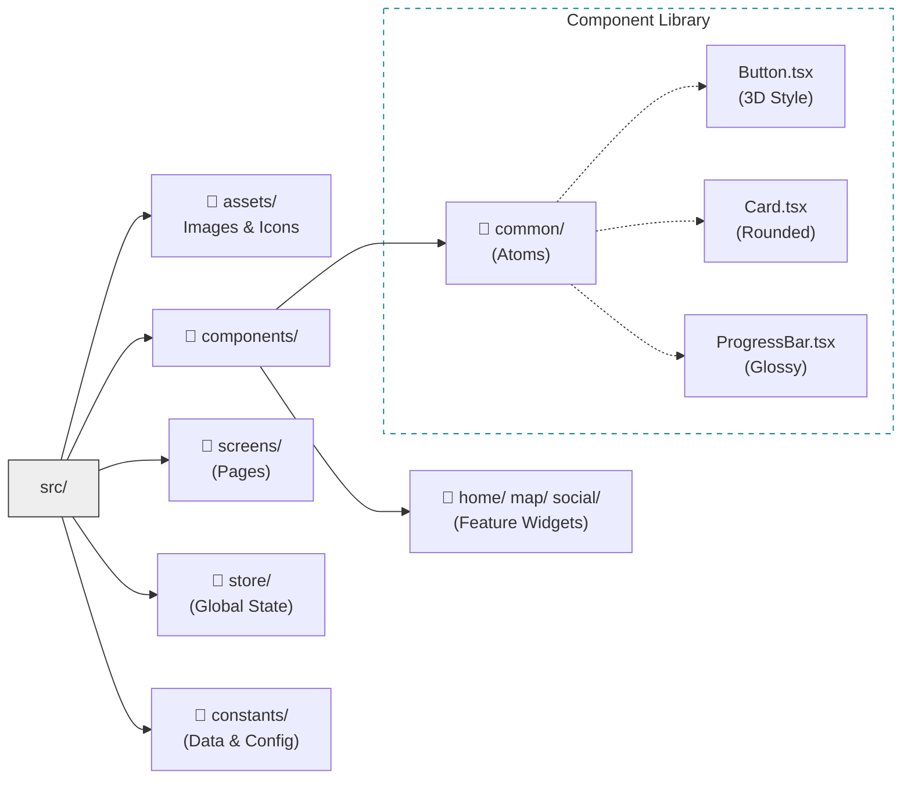
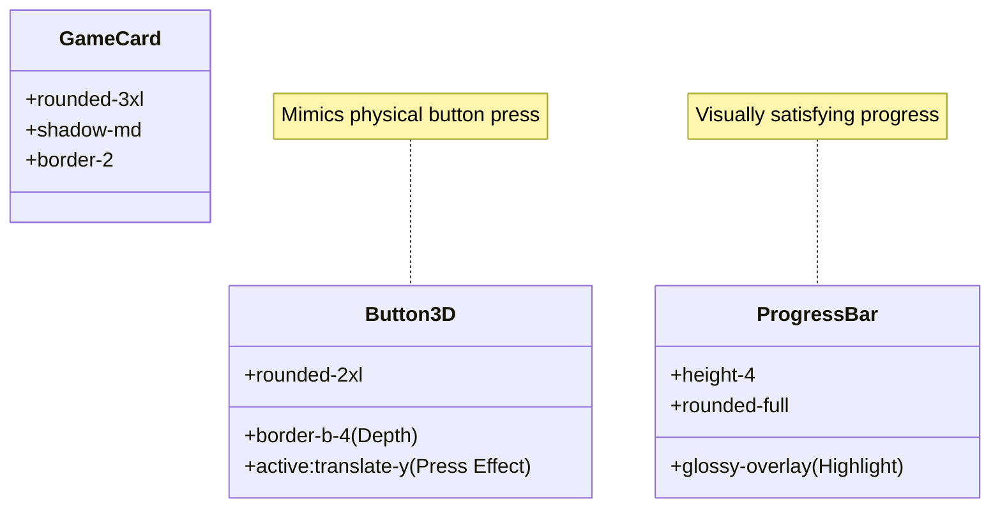

# Phase 2: Foundation & Architecture Visualization

This document visualizes the technical foundation established for the ENHGAGE application.

## 1. Technology Stack Architecture
The application is built on a modern, performance-focused stack centered around React and Vite.

## 2. Project Directory Structure
The codebase follows a scalable feature-based architecture, utilizing absolute imports (`@/`) for cleaner code.

## 3. Core Component Design ("The Juice")
We implemented a specific "Juicy" interaction model for our core UI components.

