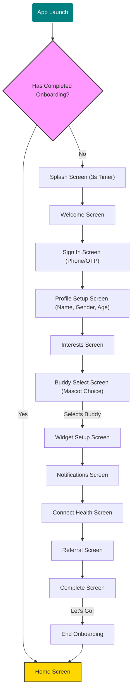
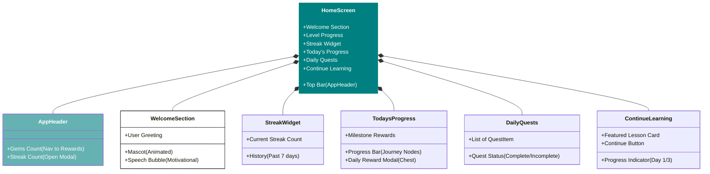

# MVP User Flow Diagrams

The following diagrams visualize the core user flows of the ENHGAGE application as implemented in the current codebase (`OnboardingFlow.tsx` and `HomeScreen.tsx`).

## 1. Onboarding Flow
This diagram illustrates the step-by-step journey a new user takes from launching the app to reaching the home screen.

## 2. Home Dashboard Structure
This diagram breaks down the different interactive sections and components present on the `HomeScreen`.

