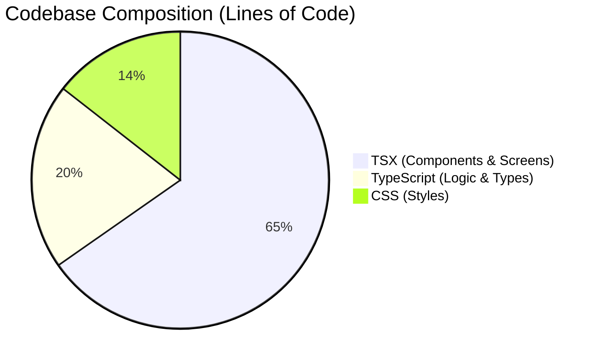

# 📊 Project Code Statistics

Here is the breakdown of the ENHGAGE project codebase (`src/` directory), categorized by file type.

## Summary
*   **Total Files**: 137
*   **Total Lines of Code**: 36,052

## Breakdown by Language

| Language | Files | Lines of Code | % of Codebase |
| :--- | :--- | :--- | :--- |
| **TypeScript React** (`.tsx`) | 115 | 23,538 | 65.3% |
| **TypeScript** (`.ts`) | 20 | 7,308 | 20.3% |
| **CSS** (`.css`) | 2 | 5,206 | 14.4% |

## Visualization

> **Note**: These statistics exclude `node_modules`, build artifacts, and configuration files outside of `src`.
